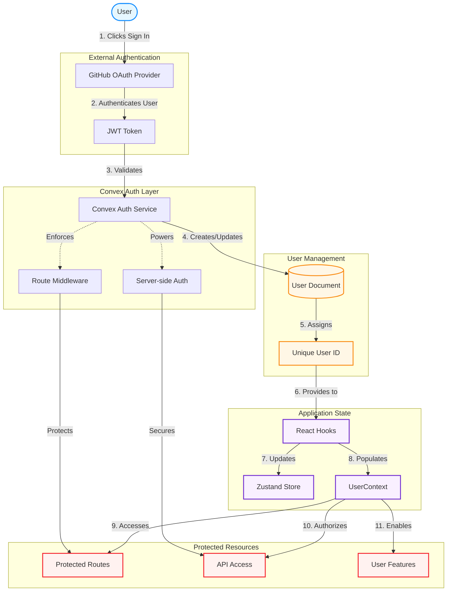

<table>
  <tr>
    <td>
      <pre>
 ____        _       _     _   
/ ___|  ___ | | ___ (_)___| |_ 
\___ \ / _ \| |/ _ \| / __| __|
 ___) | (_) | | (_) | \__ \ |_ 
|____/ \___/|_|\___/|_|___/\__|
      </pre>
    </td>
  </tr>
</table>

# solo-heatMaps
Solo (Solomon Powered) heatMaps is a unique daily log. Users input a variety of objectives/ personal goals/ or unique &amp; custom requirements, and begin to fill out Daily Logs based on their experiences each day. Each day is then evaluated by Solomon (Ai) and scored from 0 (Worst-day-Ever) - 100 (Best-day-Ever). The scores are reflected in a heatmap.

#### Git Update Version Main Commands (steps)
1. git add .
2. git commit -m "Updated Soloist"
3. git push origin main

**development instructions:**   
4. git checkout -b *new-branch*   
5. git add ./ commit/ push as usual

Authetication:
